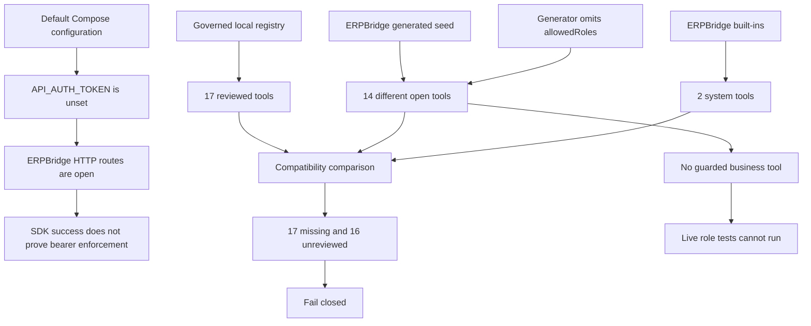

# RCA: SDK Integration Testing with ERPBridge

**Date:** 2026-08-24  
**Scope:** ERPBridge, `@erpbridge/sdk`, and the governed workflow-engine adapter  
**Status:** Investigation only. No source, server configuration, database, registry, or deployment configuration was changed.

## Executive summary

The three reported issues have one common cause: the test used three different contracts as if they were one contract.

1. ERPBridge ran in its documented open-auth mode. Successful requests therefore did not prove bearer-token enforcement.
2. The workflow engine reviewed 17 guarded business tools. The running ERPBridge instance exposed 14 different open ERP tools and two built-in system tools. No live guarded business tool existed for role testing.
3. The workflow engine registry and the ERPBridge registry have different sources of truth. The compatibility check correctly failed closed when it found no common tool names.

The evidence does not show an SDK transport defect or an ERPBridge authorization-code defect. It shows an environment and fixture provisioning gap. The default local deployment also has a security risk if it is reachable outside a trusted development host.

## Evidence collected

The investigation used these repositories:

- ERPBridge: `44b9009` on `main`
- `@erpbridge/sdk`: `75b5ebd` on `main`
- Governed workflow engine adapter: `2292691` on `feat/governed-erpbridge-mcp`

The following read-only checks ran:

| Check | Result |
| --- | --- |
| ERPBridge focused auth, RBAC, server, and generator tests | Passed |
| Governed adapter and registry tests | 11 tests passed |
| SDK MCP compatibility probe | Passed, 16 tools discovered |
| SDK authenticated integration test with only `ERPBridge_TEST_SERVER` | 6 tests skipped |
| Governed registry compatibility command | Failed closed with 17 missing and 16 unreviewed tools |

The compatibility command used a non-secret placeholder token against the current open local server. It proved the registry mismatch. It did not prove authenticated behavior.

## Reproduction of registry drift

The governed adapter uses `@erpbridge/sdk` to connect, call `tools/list`, and compare the remote names and input schemas:

- `../temp/low-code-workflow-engine/backend-ts/scripts/verify-erpbridge-registry.mjs:22-53`
- `../temp/low-code-workflow-engine/backend-ts/src/tools/erpbridge-registry-compatibility.ts:13-65`

The read-only command returned:

```text
compatible: false
missing: 17
incompatible: 0
unreviewed: 16
duplicateRemoteNames: 0
```

### Local reviewed set

`../temp/low-code-workflow-engine/backend-ts/configs/runtime/all_tools_master_registry.json` contains 17 reviewed tools. The names are:

```text
approval.request_human_approval
audit.write_audit_log
capability.create_capability_request
classify_invoice
create_leave
demo.echo
fetch_attendance
finance.clear_invoice
finance.record_invoice_receipt
inventory.record_goods_receipt
notify_finance
policy.check_policy_limit
policy_check
procurement.create_purchase_order
procurement.validate_vendor
refresh_connector
send_webhook
```

All 17 entries have non-empty `allowed_roles` values.

### Remote MCP set

The running ERPBridge returned 16 MCP tools:

```text
create_purchase_invoice
get_employee
get_item
get_purchase_invoice
list_bins
list_departments
list_employees
list_items
list_journal_entries
list_leave_applications
list_payment_entries
list_purchase_invoices
list_purchase_orders
list_salary_slips
system.progress_test
system.sensitive_log_test
```

The set intersection is empty. Therefore:

\[
|L| = 17, \quad |R| = 16, \quad |L \cap R| = 0
\]

The result is 17 missing local names and 16 unreviewed remote names.

The ERPBridge REST registry returned 14 persisted tools. The two extra MCP tools are built-ins. ERPBridge always registers these built-ins and does not store them in the SQLite tool registry (`internal/mcp/server.go:119-170`). The MCP list filter always retains names that start with `system.` (`internal/mcp/server.go:438-452`).

## Root-cause analysis

### Issue 1: Authentication was disabled by default

**Finding:** Confirmed. This behavior is intentional in the current server contract.

ERPBridge reads `API_AUTH_TOKEN` directly from the process environment. If the variable is absent or empty, `authenticateHTTP` returns the original request context and allows the route (`internal/mcp/auth.go:50-90`). No bearer header is checked in that branch.

The default deployment does not set this variable:

- `docker-compose.yml:33-46` has no `API_AUTH_TOKEN` entry.
- `.env.example:12-23` has no inbound token entry.
- `docs/environment-variables.md:25-27` documents an unset default.
- `docs/api.md:7-21` documents open mode.

ERPBridge does not load `.env` automatically. The token must be supplied by the process or container environment.

The live local server confirmed this state. An unauthenticated MCP `initialize` request returned HTTP 200 and a session ID. An unauthenticated registry request returned HTTP 200.

#### Causal chain

1. The Compose service started without `API_AUTH_TOKEN`.
2. ERPBridge entered open HTTP mode.
3. The SDK sent a request that the server accepted without checking its bearer value.
4. The successful call was interpreted as proof of token enforcement.
5. The proof was invalid because open mode accepts both missing and invalid credentials.

The SDK adapter does send the configured token on MCP requests (`../temp/low-code-workflow-engine/backend-ts/src/tools/erpbridge-mcp-client.ts:44-54`). A client token cannot enable server-side authentication.

The SDK authentication integration suite also requires externally provisioned variables for the server, admin token, scoped tokens, and role test values. Without those variables, the suite skips six tests. This is defined in `../erpbridge-sdk/tests/integration/auth.test.ts:9-24` and `:85-98`.

**Impact:** Any HTTP route protected by `AuthHandler` remains open in this mode. This includes MCP, registry, direct invoke, cache, logs, metrics, and token administration. The health endpoint is open by design and is not an authentication test.

**Conclusion:** This is a deployment precondition failure, not an SDK authentication failure. It is a security risk outside a trusted local development boundary.

### Issue 2: No guarded ERPBridge tools were available

**Finding:** Confirmed. The running registry contains no guarded business tool.

ERPBridge supports guarded tools. `Security.AllowedRoles` is part of the tool schema (`internal/mcp/tool.go:84-95`). The server validates the role list, adds a role selector to MCP discovery, and applies `RoleAuthzMiddleware` before cache and ERP execution (`internal/mcp/server.go:772-810`, `:492-504`). The middleware checks both verified caller identity and tool allow-list membership (`internal/mcp/authz.go:45-125`).

The current runtime data contains no `allowedRoles` entries. The generated schemas under `schemas/` also contain no `allowedRoles` entries. One schema description says that invoice creation requires `finance_editor`, but a description does not enforce authorization.

The OpenAPI generator explains this result. Both generator paths populate `authType` and `credentialRef`, but they do not populate `AllowedRoles`:

- `internal/idp/generator.go:45-71`
- `internal/idp/generator.go:191-219`

The mock ERP also has downstream role checks. Those checks use the upstream ERP credential and do not create ERPBridge caller roles. They are not a substitute for `spec.security.allowedRoles`.

#### Causal chain

1. The workflow registry reviewed 17 governed tools with role policy.
2. The ERPBridge seed path generated different tools from `mock-erp/openapi.yaml`.
3. The generator did not translate role policy into `allowedRoles`.
4. The applied ERPBridge tools were open tools.
5. `tools/list` exposed no guarded business tool.
6. The live test had no tool on which to exercise role denial or role success.

The workflow adapter still covers its local policy. Its unit tests pass cases for:

- workflow-supplied role rejection
- missing mapped ERPBridge role
- mapped role injection
- MCP tool failure handling
- no second call after an ambiguous transport failure

These checks are in `../temp/low-code-workflow-engine/backend-ts/tests/erpbridge-mcp-client.test.ts:211-251`.

ERPBridge also has unit tests for role selection, missing identity, allow-list denial, schema injection, direct invoke, and role-scoped cache behavior. These tests use synthetic guarded tools. They do not prove that a production seed path creates a guarded tool.

**Impact:** The integration test cannot prove live role enforcement. More importantly, a tool description that claims a role requirement remains open at the ERPBridge layer when `allowedRoles` is absent.

**Conclusion:** The evidence points to missing guarded fixture data and missing generator mapping. It does not show a failure in the existing authorization middleware.

### Issue 3: Registry drift

**Finding:** Confirmed. The compatibility check correctly failed closed.

The governed adapter treats `configs/runtime/all_tools_master_registry.json` as its reviewed source. The script loads this registry, opens an SDK MCP session, calls `tools/list`, and compares names and input schemas. It throws when any missing, incompatible, unreviewed, or duplicate entry exists (`../temp/low-code-workflow-engine/backend-ts/src/tools/erpbridge-registry-compatibility.ts:30-65`).

The two registries are independent:

| Registry | Source | Current content |
| --- | --- | --- |
| Reviewed workflow registry | `backend-ts/configs/runtime/all_tools_master_registry.json` | 17 governed names with role policy |
| ERPBridge managed registry | SQLite at the server `DATABASE_PATH` | 14 active generated ERP tools |
| ERPBridge MCP surface | Runtime MCP server | 14 managed tools plus 2 built-ins |

ERPBridge persists tool definitions in SQLite (`internal/mcp/store.go:21-158`). The Docker deployment stores this database in the named `erpbridge-data` volume (`docker-compose.yml:45-46`). The host `data/` directory and `schemas/` directory are ignored by Git. The Docker build also excludes `schemas/` through `.dockerignore`.

`bridgectl tool apply` sends each local schema to the remote registry. It does not compare the local directory with the reviewed workflow registry. It does not remove remote tools that are absent from the local directory (`internal/cli/tool.go:77-151`). ERPBridge reconciliation only aligns its in-memory registry with its own SQLite store. It does not read the workflow engine registry (`internal/mcp/server.go:354-418`).

#### Primary cause

The deployment has no single registry release artifact and no cross-repository synchronization step. A generated ERPBridge catalog can therefore coexist with a different governed workflow catalog.

#### Contributing causes

1. The two catalogs use different tool naming models. For example, the workflow registry has `fetch_attendance`, while the current ERPBridge registry has `list_employees`.
2. The ERPBridge seed process is additive. It applies definitions but does not prune stale definitions.
3. The remote MCP list includes built-in system tools that are not in the workflow registry.
4. The compatibility check compares MCP names and input schemas. It does not compare `allowed_roles`, risk, side effects, endpoint, or descriptions.

The last item is a residual coverage gap. It did not cause this failure because the two name sets have no overlap. It can hide policy drift after names become aligned.

**Impact:** The workflow engine correctly refuses to dispatch against an unreviewed or incomplete remote surface. The integration cannot proceed until both sides use the same catalog and policy.

**Conclusion:** This is a release and registry-governance failure. It is not a false positive from the fail-closed comparison.

## Combined causal model



## What the evidence does not show

- It does not show an MCP protocol incompatibility. The SDK compatibility probe completed initialization and discovered 16 tools.
- It does not show an SDK retry defect. The governed adapter sets `mcpRetryPolicy: "never"`, and its no-second-call unit test passed.
- It does not show an ERPBridge RBAC middleware defect. Focused server RBAC tests passed.
- It does not show that the historical deployment action was a single failed command. The current state proves that the catalogs were not synchronized, but it does not identify the original seed event.

## Approval decisions before implementation

1. **Authentication:** Keep open mode for local development, or require `API_AUTH_TOKEN` for every integration environment. The integration gate must fail when the server does not return 401 for an anonymous protected MCP request.
2. **Guarded fixture:** Deploy one non-production guarded tool with `allowedRoles`, and provision a scoped MCP token with a matching role. Test allowed, missing, wrong, and workflow-supplied roles.
3. **Registry source:** Choose one catalog as the release source:
   - deploy the 17 governed tools to an isolated ERPBridge instance, or
   - update the workflow registry to the 14 ERPBridge tools and explicitly review the two built-ins.
4. **Built-ins:** Exclude `system.*` from the governed business comparison, or add an explicit review policy for them.
5. **Metadata comparison:** Decide whether the compatibility gate must compare role policy, risk, side effects, and execution metadata in addition to names and input schemas.
6. **Deployment sync:** Add an explicit readback and controlled stale-tool removal step. Do not use manual registry edits as the release process.

## Recommended verification matrix after approval

| Area | Required proof |
| --- | --- |
| Authentication | Anonymous protected MCP request returns 401. Wrong bearer returns 401. Valid `mcp` token initializes. Wrong scope returns 403. |
| Guarded discovery | `tools/list` exposes the guarded tool and its role selector. |
| Guarded denial | Missing selector, token-role mismatch, and tool-role mismatch fail before ERP execution. |
| Guarded success | A scoped token with a permitted role succeeds through MCP. |
| Workflow adapter | A workflow cannot supply its own role. The adapter sends only the mapped verified role. |
| Registry | The reviewed and remote business sets match. Schemas and approved policy metadata match. Built-in handling follows the approved rule. |
| SDK | Run the compatibility probe, live integration suite, unit tests, and build against the isolated server. |

## Investigation boundary

No server restart, registry apply, registry delete, token creation, database edit, or source change was performed. Read-only MCP sessions were created for discovery. The compatibility command only initialized an MCP session and called `tools/list`. The report records no credential value.
