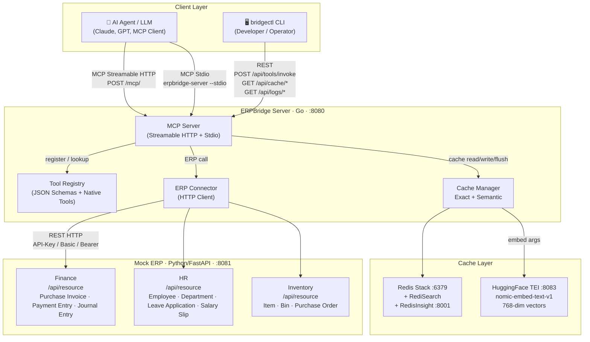
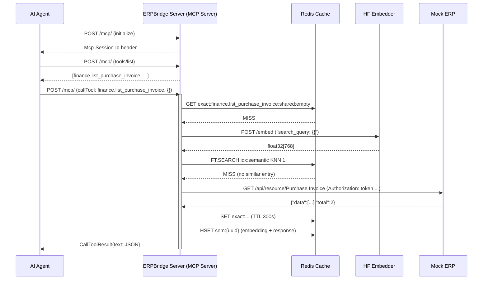
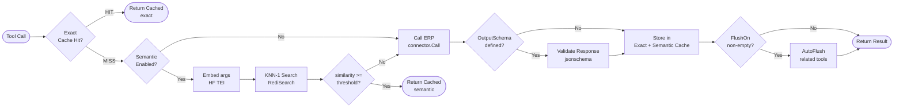
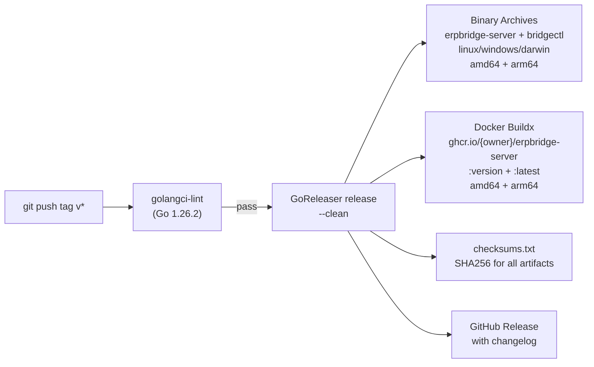

# ERPBridge — Comprehensive Codebase Report

> **Generated:** 2026-05-08 | **Last Updated:** 2026-05-08  
> **Repository:** [nmdra/ERPBridge](https://github.com/nmdra/ERPBridge)  
> **Module:** `github.com/nimendra/ERPBridge`  
> **Go Version:** 1.26.2 | **Python Version:** 3.11+

---

## Table of Contents

1. [Project Overview](#1-project-overview)
2. [Architecture Diagram](#2-architecture-diagram)
3. [Repository Structure](#3-repository-structure)
4. [Technology Stack](#4-technology-stack)
5. [Component Deep-Dives](#5-component-deep-dives)
   - 5.1 [Mock ERP (Python/FastAPI)](#51-mock-erp-pythonfastapi)
   - 5.2 [ERPBridge Server (Go/MCP)](#52-erpbridge-server-gomcp)
   - 5.3 [bridgectl CLI (Go/Cobra)](#53-bridgectl-cli-gocobra)
6. [Internal Packages Reference](#6-internal-packages-reference)
   - 6.1 [internal/mcp](#61-internalmcp)
   - 6.2 [internal/cache](#62-internalcache)
   - 6.3 [internal/connector](#63-internalconnector)
   - 6.4 [internal/config](#64-internalconfig)
   - 6.5 [internal/idp](#65-internalidp)
   - 6.6 [internal/logger](#66-internallogger)
   - 6.7 [internal/output](#67-internaloutput)
   - 6.8 [internal/cli](#68-internalcli)
   - 6.9 [internal/metrics](#69-internalmetrics)
   - 6.10 [internal/types](#610-internaltypes)
7. [Data Flow](#7-data-flow)
8. [Semantic Caching System](#8-semantic-caching-system)
9. [Tool Schema System](#9-tool-schema-system)
10. [Authentication Model](#10-authentication-model)
11. [Configuration System](#11-configuration-system)
12. [API Endpoints Reference](#12-api-endpoints-reference)
13. [Docker & Deployment](#13-docker--deployment)
14. [Release Pipeline (GoReleaser)](#14-release-pipeline-goreleaser)
15. [CI/CD Workflow (GitHub Actions)](#15-cicd-workflow-github-actions)
16. [Testing](#16-testing)
17. [Key Design Patterns](#17-key-design-patterns)
18. [Known Limitations & Future Work](#18-known-limitations--future-work)

---

## 1. Project Overview

**ERPBridge** is an AI middleware layer that connects legacy ERP (Enterprise Resource Planning) systems to modern Agentic AI agents via the **Model Context Protocol (MCP)**. The project solves a fundamental interoperability problem: LLMs and autonomous AI agents cannot natively speak to business systems like SAP, Oracle, or custom-built ERP services. ERPBridge translates ERP REST API calls into standardized MCP "Tools" that any MCP-compatible AI client can discover and invoke.

### Core Value Proposition

| Problem | ERPBridge Solution |
|---|---|
| LLMs don't speak REST natively | Wraps ERP calls as typed MCP Tools |
| Each ERP has unique auth/schemas | Unified connector + JSON Schema tools |
| Repeated identical queries drain ERP | Two-layer Redis semantic cache |
| Debugging AI↔ERP interactions is hard | Real-time log streaming + `bridgectl` CLI |
| Adding new ERP endpoints requires coding | Auto-generate tool schemas from OpenAPI specs |

---

## 2. Architecture Diagram

### Mermaid Diagram



### Component Interaction (Sequence)



### Cache Decision Flow



---

### ASCII Diagram (plaintext fallback)

```
┌─────────────────────────────────────────────────────────────────────┐
│                         AI Agent / LLM Client                       │
│                   (Claude, GPT, Custom MCP Client)                  │
└─────────────────────────────────┬───────────────────────────────────┘
                                  │  MCP Streamable HTTP / Stdio (port 8080)
                                  ▼
┌─────────────────────────────────────────────────────────────────────┐
│                         MIDDLEWARE (Go)                              │
│                                                                      │
│   ┌───────────────┐   ┌───────────────┐   ┌──────────────────────┐ │
│   │  MCP Server   │   │  Tool Registry│   │  Cache Manager       │ │
│   │(Streamable HTTP│──▶│ (JSON Schemas│   │  Exact + Semantic    │ │
│   │   + Stdio)     │   │ + Native Tools│  │                     │ │
│   └───────┬───────┘   └───────────────┘   └──────────┬───────────┘ │
│           │                                           │             │
│   ┌───────▼───────┐                         ┌────────▼───────────┐ │
│   │  ERP Connector│                         │  Redis Stack       │ │
│   │  (HTTP Client)│                         │  + RediSearch      │ │
│   └───────┬───────┘                         │  + HF Embedder     │ │
│           │                                 └────────────────────┘ │
└───────────┼─────────────────────────────────────────────────────────┘
            │  REST HTTP  (port 8081)
            ▼
┌───────────────────────────────────────────────────────┐
│                  MOCK ERP (Python/FastAPI)             │
│                                                       │
│  ┌─────────────┐  ┌─────────────┐  ┌─────────────┐  │
│  │  Finance    │  │    HR       │  │  Inventory  │  │
│  │ Purchase Inv│  │  Employee   │  │   Item/Bin  │  │
│  └─────────────┘  └─────────────┘  └─────────────┘  │
└───────────────────────────────────────────────────────┘

       ┌──────────────────────────────┐
       │  bridgectl (Go CLI)          │
       │  Developer/Agent CLI Tool    │
       │  context | api | tool |      │
       │  log | cache                 │
       └──────────────────────────────┘
```


## 3. Repository Structure

```
ERPBridge/
│
├── services/
│   └── erpbridge-server/
│       └── main.go             # ERPBridge server entrypoint (Streamable HTTP + Stdio)
│
├── tools/
│   └── bridgectl/
│       └── main.go             # CLI entrypoint
│
├── internal/                   # Shared Go libraries
│   ├── mcp/
│   │   ├── server.go           # MCP server + HTTP handlers
│   │   ├── middleware.go       # Tool middleware chain (logging/metrics/cache)
│   │   ├── notifications.go    # MCP custom notifications
│   │   ├── resource.go         # MCP resource definitions
│   │   ├── prompt.go           # MCP prompt templates
│   │   └── tool.go             # Tool struct + Execute() logic
│   ├── cache/
│   │   ├── manager.go          # Two-layer cache orchestration
│   │   ├── exact.go            # Exact-match Redis cache
│   │   ├── semantic.go         # Vector similarity search
│   │   ├── flush.go            # Cache invalidation
│   │   ├── embedder.go         # HuggingFace embedder client
│   │   └── manager_test.go     # Unit tests
│   ├── connector/
│   │   ├── client.go           # Outbound HTTP ERP client
│   │   ├── client_test.go      # Unit tests
│   │   └── resilience_test.go  # Retry + circuit breaker tests
│   ├── config/
│   │   ├── config.go           # Multi-context YAML config
│   │   └── config_test.go      # Unit tests
│   ├── idp/
│   │   ├── registry.go         # API registration store
│   │   ├── generator.go        # Tool schema generator (incl. OpenAPI)
│   │   └── generator_test.go   # OpenAPI generator tests
│   ├── logger/
│   │   ├── logger.go           # Broadcast slog + log buffer
│   │   ├── mcp_handler.go      # MCP log streaming + redaction
│   │   ├── level.go            # RFC 5424 log level mapping
│   │   └── context.go          # Request-scoped logger context
│   ├── metrics/
│   │   └── metrics.go          # Prometheus metrics
│   ├── output/
│   │   ├── formatter.go        # Table/JSON/YAML output formatter
│   │   └── formatter_test.go   # Unit tests
│   ├── cli/
│   │   ├── root.go             # Cobra root + global flags
│   │   ├── context.go          # `bridgectl context` commands
│   │   ├── api.go              # `bridgectl api` commands
│   │   ├── tool.go             # `bridgectl tool` commands
│   │   ├── log.go              # `bridgectl log` commands
│   │   ├── cache.go            # `bridgectl cache` commands
│   │   ├── doc.go              # `bridgectl doc` generator
│   │   ├── version.go          # `bridgectl version`
│   │   └── errors.go           # Actionable CLI errors
│   └── types/
│       └── sensitive.go        # Redaction marker types
│
├── mock-erp/                   # Python FastAPI mock ERP
│   ├── main.py                 # FastAPI app + router inclusion
│   ├── dependencies.py         # ERPNext-style auth + error helpers
│   ├── openapi.yaml            # ERPNext-flavoured OpenAPI spec
│   ├── pyproject.toml          # uv-managed Python dependencies
│   ├── uv.lock                 # uv lockfile
│   ├── Dockerfile              # Mock ERP container
│   └── routers/
│       ├── finance.py          # Purchase invoices, payments, journals
│       ├── hr.py               # Employees, departments, leave, salary
│       └── inventory.py        # Items, bins, purchase orders
│
├── docs/
│   ├── README.md               # Wiki-style documentation index
│   ├── connectivity.md         # MCP transport + Postman guide
│   ├── docker.md               # Docker usage guide
│   ├── mcp-client-guide.md     # MCP client integration guide
│   └── cli/                    # Auto-generated bridgectl docs
│
├── schemas/                    # Generated MCP tool schemas (gitignored)
│
├── .env.example                # Environment variable template (all runtime vars)
├── .github/
│   └── workflows/
│       └── release.yml         # GoReleaser CI/CD pipeline (lint → release → Docker)
├── .goreleaser.yaml            # Multi-platform release configuration
├── docker-compose.yml          # Full stack orchestration
├── Dockerfile.server           # Development server container
├── Dockerfile.server.releaser  # Production server container
├── CHANGELOG.md                # Release notes
├── erpbridge_postman_collection.json # Postman collection for MCP HTTP
├── .dockerignore               # Docker build ignore rules
├── lefthook.yml                # Local git hooks (lint)
├── go.mod                      # Go module definition
├── go.sum                      # Go dependency checksums
├── README.md                   # Project documentation
└── AGENTS.md                   # AI Agent integration guide
```

---

## 4. Technology Stack

### Go Layer (ERPBridge Server + CLI)

| Library | Version | Purpose |
|---|---|---|
| `mark3labs/mcp-go` | v0.51.0 | MCP protocol server (Streamable HTTP + Stdio) |
| `m-mizutani/masq` | v0.2.1 | Sensitive log redaction |
| `prometheus/client_golang` | v1.23.2 | Prometheus metrics export |
| `fsnotify/fsnotify` | v1.10.1 | Schema hot reloading |
| `avast/retry-go/v4` | v4.7.0 | ERP retry logic |
| `sony/gobreaker` | v1.0.0 | Circuit breaker for ERP calls |
| `spf13/cobra` | v1.10.2 | CLI framework for `bridgectl` |
| `redis/go-redis/v9` | v9.19.0 | Redis client (exact + vector search) |
| `goccy/go-yaml` | v1.19.2 | YAML config parsing |
| `getkin/kin-openapi` | v0.137.0 | OpenAPI 3.x spec parsing for schema generation |
| `santhosh-tekuri/jsonschema/v6` | v6.0.2 | JSON Schema validation for tool responses |
| `google/uuid` | v1.6.0 | UUID generation for semantic cache keys |
| `log/slog` | stdlib | Structured logging (Go 1.21+) |

### Python Layer (Mock ERP)

| Library | Purpose |
|---|---|
| `fastapi` | REST API framework |
| `uvicorn` | ASGI server |
| `pydantic` | Request/response model validation |
| `python-multipart` | Form/multipart body parsing (FastAPI dependency) |
| `uv` | Dependency management for the mock ERP service |

### Infrastructure

| Component | Technology | Port |
|---|---|---|
| Mock ERP | Python FastAPI | 8081 |
| ERPBridge Server (MCP) | Go | 8080 |
| Redis + RediSearch | redis/redis-stack:7.2.0-v9 | 6379 / 8001 (RedisInsight) |
| Text Embedder | HuggingFace TEI (`nomic-embed-text-v1`) | 8083 |

---

## 5. Component Deep-Dives

### 5.1 Mock ERP (Python/FastAPI)

**Location:** `mock-erp/`  
**Port:** `8081`

The Mock ERP now mirrors **ERPNext**-style APIs. It exposes resource-style endpoints under `/api/resource` and ships an OpenAPI spec (`mock-erp/openapi.yaml`) to drive MCP tool generation.

#### Modules

| Module | Prefix | Endpoints |
|---|---|---|
| Finance | `/api/resource` | `GET/POST Purchase Invoice`, `GET Payment Entry`, `GET Journal Entry` |
| HR | `/api/resource` | `GET Employee`, `GET Department`, `GET Leave Application`, `GET Salary Slip` |
| Inventory | `/api/resource` | `GET Item`, `GET Bin`, `GET Purchase Order` |

#### Authentication (`dependencies.py`)

The mock ERP now follows ERPNext-style auth flows, resolved in order:

1. **ERPNext Token Auth** — `Authorization: token api_key:api_secret`
2. **Session Cookie** — `sid` cookie for session-based access
3. **HTTP Basic Auth** — fallback for browser simulation (`admin:admin`)

**Predefined Token Credentials:**

```
fin_key_001:fin_sec_abc123  →  finance_viewer
fin_key_002:fin_sec_def456  →  finance_editor
hr_key_001:hr_sec_ghi789    →  hr_viewer
hr_key_002:hr_sec_jkl012    →  hr_manager
inv_key_001:inv_sec_mno345  →  inv_viewer
inv_key_002:inv_sec_pqr678  →  inv_editor
adm_key_001:adm_sec_stu901  →  admin
```

**Role-Based Access Control:** The `check_role()` function enforces permissions on write operations. For example, `POST /api/resource/Purchase Invoice` requires the `finance_editor` role. The `admin` role bypasses all checks.

#### Finance Data Model (ERPNext Purchase Invoice)

```python
class PurchaseInvoice(BaseModel):
    name: str            # e.g. "ACC-PINV-2026-00001"
    doctype: str         # "Purchase Invoice"
    supplier: str
    posting_date: str
    grand_total: float
    status: str          # "Unpaid" | "Paid"
```

---

### 5.2 ERPBridge Server (Go/MCP)

**Location:** `services/erpbridge-server/main.go`  
**Port:** `8080`

The ERPBridge server is the heart of the platform. It is a Go process that:
1. Initialises the structured logger (broadcast + MCP logging handler)
2. Optionally connects to Redis + embedder for caching
3. Creates the `connector.Client` (outbound HTTP to ERP)
4. Creates the `mcp.Server` (tools, resources, prompts, middleware)
5. Loads JSON tool schemas and native tools
6. Starts recursive schema hot-reloading (fsnotify)
7. Serves MCP over **Streamable HTTP** (`/mcp/`) or **Stdio** (`--stdio` / `MCP_TRANSPORT=stdio`)
8. Exposes management endpoints, log streaming, and Prometheus metrics

#### Startup Flow

```
main()
  ├── parse --stdio / MCP_TRANSPORT
  ├── logger.Init()            → structured slog + broadcast
  ├── redis.NewClient()        → optional Redis connection
  ├── cache.NewHFEmbedder()    → optional embedding client (HuggingFace TEI)
  ├── cache.NewManager()       → two-layer cache (exact + semantic)
  ├── connector.NewClient()    → HTTP client to ERP
  ├── mcp.NewServer()          → MCP protocol wrapper + middlewares
  ├── loadTools(dir)           → walk schemas/*.json → RegisterTool()
  ├── watchSchemas(dir)        → fsnotify recursive hot reload
  ├── ServeStdio() (optional)  → MCP Stdio transport
  └── ServeHTTP()              → /mcp/ + /api/* + /metrics
```

#### Environment Variables

| Variable | Default | Description |
|---|---|---|
| `MCP_PORT` | `8080` | HTTP listen port |
| `SCHEMAS_DIR` | `schemas` | Path to JSON tool schema directory |
| `REDIS_URL` | *(empty)* | Redis connection URL — cache disabled if absent |
| `EMBEDDER_URL` | *(empty)* | HuggingFace TEI base URL — semantic cache disabled if absent |
| `BASE_URL` | `http://localhost:{MCP_PORT}` | Base URL used in MCP HTTP logs and tooling |
| `ERP_BASE_URL` | *(empty)* | Base URL for the ERP service (used in docker-compose) |
| `MCP_TRANSPORT` | *(empty)* | Set to `stdio` to enable MCP Stdio transport |
| `LOG_LEVEL` | `info` | Log level: `debug`, `info`, `warn`, `error` |
| `APP_ENV` | `development` | `production` enables JSON log format; otherwise text |
| `LOG_TO_STDERR` | `false` | When true, log output is sent to stderr (stdio mode) |
| `LOG_LEVEL_{COMPONENT}` | *(empty)* | Per-component overrides (e.g., `LOG_LEVEL_MCP=debug`) |

---

### 5.3 bridgectl CLI (Go/Cobra)

**Location:** `tools/bridgectl/main.go`, `internal/cli/`

`bridgectl` is the developer and agent operator CLI. It communicates with the ERPBridge Server's REST management API (`/api/*`). Built with Cobra, it has a hierarchical command structure.

#### Command Tree

```
bridgectl
├── context
│   ├── list                    # Show all saved contexts with active indicator
│   └── set [name]              # Switch active context + save config
├── api
│   ├── register                # Register a new ERP endpoint in local registry
│   ├── list                    # List all registered APIs
│   └── test [name]             # Fire a test HTTP request to the API
├── tool
│   ├── list                    # List all JSON schemas in schemas/ directory
│   ├── generate                # Generate a schema from a registered API
│   └── invoke [name] [args]    # Call a tool via /api/tools/invoke
├── log
│   ├── tail                    # SSE stream from /api/logs/stream
│   └── stats                   # Fetch recent logs + display level breakdown
└── cache
    ├── stats                   # GET /api/cache/stats
    └── flush [tool]            # Flush by tool, module, or all

Additional Commands:
  ├── doc                        # Generate Markdown docs to docs/cli
  └── version                    # Print bridgectl version

Global Flags:
  -o, --output  table|json|yaml   (default: table)
  -c, --context <name>            Override active context
  -v, --verbose                   Enable debug log level
```

#### Output Formatting

Every CLI command produces output through `internal/output.Formatter`. Each response struct implements `TableRenderer` (for human-readable aligned tables) while also being JSON/YAML-serialisable for machine consumption.

---

## 6. Internal Packages Reference

### 6.1 `internal/mcp`

**Files:** `server.go`, `tool.go`, `middleware.go`, `notifications.go`, `resource.go`, `prompt.go`

This package wraps `mark3labs/mcp-go` and provides tool/resource/prompt registration, streamable HTTP transport wiring, custom notifications, and the middleware chain (logging, metrics, cache).

#### Key Types

```go
// Tool — the full definition of an MCP Tool, loaded from a JSON schema file
type Tool struct {
    Name         string        // Unique identifier, e.g. "finance.list_purchase_invoice"
    Description  string        // Shown to AI agents during tool discovery
    Module       string        // ERP module grouping (finance, hr, inventory)
    InputSchema  InputSchema   // JSON Schema describing accepted arguments
    OutputSchema *any          // Optional JSON Schema for response validation
    Endpoint     *Endpoint     // HTTP endpoint config for the ERP call
    Cache        *cache.Config // Per-tool cache policy
    Handler      func(ctx context.Context, args map[string]any) (*ToolResult, error) // Optional native Go handler
}

// Endpoint — routing info for the ERP call
type Endpoint struct {
    Method string   // GET | POST | PATCH | DELETE
    Path   string   // Absolute URL or relative path
    Auth   AuthInfo // Auth credentials/config
}

// ToolResult — unified result envelope
type ToolResult struct {
    Result  any  // Decoded JSON from ERP
    Error   any  // Error detail if any
    IsError bool // True if ERP returned 4xx/5xx
}

// Resource — MCP resource definition (URI template + endpoint)
type Resource struct { /* ... */ }

// Prompt — MCP prompt template definition
type Prompt struct { /* ... */ }
```

#### Custom Notifications

`CustomNotifier` sends structured notifications to MCP clients (progress updates, alerts, and system messages). The server registers demo tools (`system.progress_test`, `system.sensitive_log_test`) to exercise progress notifications and log redaction.

#### Tool Execution Flow (`tool.go → Execute()`)

```
Execute(ctx, args, connector)
  ├── If Handler is set → execute native Go handler
  ├── Build query params (GET) or JSON body (POST/PATCH)
  ├── Resolve full URL (respect ERP_BASE_URL overrides)
  ├── connector.Call(ctx, ep, queryParams, body)
  ├── Decode JSON response
  ├── If OutputSchema set → validateResponse() via jsonschema
  └── Return ToolResult{Result, IsError}
```

#### Middleware + Cache Integration in `server.go`

Both **MCP tool calls** (Streamable HTTP or Stdio) and **direct invoke** calls (`/api/tools/invoke`) share the same middleware chain (logging, metrics, cache):

```
READ PHASE:
  cache.Get() → exact match → return cached response (HIT)
              → semantic search → return cached response (HIT)
              → miss → proceed to ERP call

WRITE PHASE (after successful ERP call):
  cache.Set() → store in exact + semantic caches

INVALIDATION:
  if tool.Cache.FlushOn is non-empty → AutoFlush(flushOn)
```

Cache hits increment Prometheus counters (`cache_hits_total`) and return cached content through the same MCP result format.

---

### 6.2 `internal/cache`

**Files:** `manager.go`, `exact.go`, `semantic.go`, `flush.go`, `embedder.go`

The most sophisticated package in the codebase. Implements a two-layer caching strategy using Redis.

#### Cache Config (per tool, in JSON schema)

```go
type Config struct {
    Enabled           bool     // Master switch
    TTLSeconds        int      // Expiry for exact cache entries
    SemanticThreshold float32  // Cosine similarity threshold (0–1)
    IsReadOnly        bool     // true=shared across roles, false=role-isolated
    FlushOn           []string // Tool names to invalidate on successful write
}
```

#### Layer 1: Exact Cache

- **Key format:** `exact:{toolName}:{roleScope}:{argsHash}`
- **Hash:** SHA-256 of canonically sorted argument key-value pairs (truncated to 8 hex chars)
- **Storage:** Redis `SET` with TTL
- **Role scoping:** `IsReadOnly=true` uses `"shared"` scope; `false` uses the caller's role (e.g., `"finance_viewer"`)

#### Layer 2: Semantic Cache

- **Storage:** Redis Hash entries with prefix `sem:{uuid}`
- **Index:** RediSearch HNSW vector index `idx:semantic` on `args_emb` field (FLOAT32, DIM=768, COSINE distance)
- **Query:** KNN-1 search filtered by `tool` and `role` tags
- **Scoring:** `similarity = 1 - cosine_distance`. Returned only if `similarity >= SemanticThreshold`
- **Embedder:** `HFEmbedder` POSTs to `{EMBEDDER_URL}/embed` using `nomic-embed-text-v1` (768-dimensional vectors), prepending `"search_query: "` as per nomic's instruction-following spec

#### Cache Invalidation (flush.go)

| Method | Trigger | Scope |
|---|---|---|
| `FlushTool(toolName)` | Manual via `bridgectl cache flush` | Exact keys by scan pattern + semantic by FT.SEARCH tag |
| `FlushModule(module)` | Manual via `bridgectl cache flush --module` | All tools matching `module.*` pattern |
| `AutoFlush(flushOn)` | Automatic after write tool success | Each tool listed in `FlushOn` config |

---

### 6.3 `internal/connector`

**Files:** `client.go`, `client_test.go`, `resilience_test.go`

A resilient HTTP client that adds auth, structured logging, retries, circuit breaking, and Prometheus metrics to outbound ERP requests.

#### Auth Modes

| Type | Mechanism |
|---|---|
| `api-key` | Sets custom header (e.g., `X-API-Key: <value>`) |
| `basic` | `req.SetBasicAuth(username, key)` |
| `bearer` | Sets `Authorization: Bearer <token>` |

#### Request Lifecycle

```
Call(ctx, ep, queryParams, body)
  ├── Build target URL = BaseURL + Path + ?queryParams
  ├── Log request (INFO: method, path, auth_type)
  ├── Read + buffer body (for DEBUG logging)
  ├── http.NewRequestWithContext()
  ├── Apply auth header
  ├── Set Content-Type: application/json
  ├── http.Do()
  ├── Read + buffer response body (for DEBUG logging)
  ├── Log response (INFO: status, latency | WARN: if 4xx/5xx)
  └── Return *http.Response with re-wrapped body
```

Timeout is fixed at **15 seconds**. Each request increments `erp_requests_total` and records latency in `erp_request_duration_seconds`.

---

### 6.4 `internal/config`

**Files:** `config.go`, `config_test.go`

Multi-context configuration, following a kubectl-style pattern.

#### Config File Location

`~/.bridgectl/config.yaml`

#### Config Structure

```yaml
current-context: local
contexts:
  local:
    server: http://localhost:8082      # bridgectl management API
    mcp-server: http://localhost:8080  # MCP Streamable HTTP base
    erp-base: http://localhost:8081    # Direct ERP URL
    auth:
      type: api-key
      header: X-API-Key
      key: ${BRIDGE_API_KEY}           # Supports ${VAR} expansion
  prod:
    server: https://erpbridge.company.com
    ...
```

#### Environment Variable Overrides (applied after file load)

| Env Var | Config Field |
|---|---|
| `BRIDGE_CONTEXT` | `current-context` |
| `BRIDGE_SERVER` | `context.server` |
| `BRIDGE_MCP_SERVER` | `context.mcp-server` |
| `BRIDGE_ERP_BASE` | `context.erp-base` |
| `BRIDGE_AUTH_TYPE` | `context.auth.type` |
| `BRIDGE_API_KEY` | `context.auth.key` |
| `BRIDGE_TOKEN` | `context.auth.token` |
| `BRIDGE_USERNAME` | `context.auth.username` |
| `BRIDGE_PASSWORD` | `context.auth.key` (basic auth password) |

The config file also supports inline `${VAR}` environment variable references, expanded via `os.ExpandEnv` before YAML parsing.

---

### 6.5 `internal/idp`

**Files:** `registry.go`, `generator.go`

"IDP" stands for **Integration Definition Provider** — this package handles registering ERP APIs and generating MCP tool schemas from them.

#### Registry (`registry.go`)

A JSON file stored at `~/.bridgectl/registry.json` that persists registered ERP API definitions:

```go
type API struct {
    ID           string    // Auto-generated: "api-{nanosecond timestamp}"
    Name         string    // Unique human name
    URL          string    // Full endpoint URL
    Method       string    // HTTP method
    AuthType     string    // api-key | basic | bearer
    AuthHeader   string
    AuthKey      string
    AuthUsername string
    AuthToken    string
    Module       string    // ERP module (finance, hr, inventory)
    Description  string
    Status       string    // "active"
    CreatedAt    time.Time
}
```

#### Generator (`generator.go`)

Two generation modes:

**1. Basic generation (`Generate`)** — Creates a minimal tool schema from an `API` struct. For `GET` endpoints, adds a default `page` integer parameter.

**2. OpenAPI generation (`GenerateFromOpenAPI`)** — Parses an OpenAPI 3.x specification (URL or file path) using `kin-openapi` and:
- Creates one `Tool` per operation (`path × method`)
- Names tools as `{module}.{operationId}` or `{module}.{method}-{sanitized-path}`
- Maps query parameters → `InputSchema.Properties`
- Maps request body JSON properties → `InputSchema.Properties`
- Infers `OutputSchema` from the `200`/`201` response schema (used for response validation)
- Saves each tool as `schemas/{module}/{toolName}.json` (schemas directory is gitignored)

---

### 6.6 `internal/logger`

**Files:** `logger.go`, `context.go`, `level.go`, `mcp_handler.go`

A structured logging subsystem built on Go's stdlib `log/slog`, extended with:

#### Broadcast + Buffer

Every log record is:
1. Written to stdout/stderr (text in dev, JSON in production via `APP_ENV`, stderr via `LOG_TO_STDERR`)
2. Buffered (last 1000 records) for `/api/logs/recent`
3. Streamed via **SSE** on `/api/logs/stream` for `bridgectl log tail`

#### MCP Log Streaming + Redaction

The `MCPHandler` forwards log notifications to MCP clients and applies **masq** redaction:
- Redacts by custom types (`APIToken`, `Password`, `AuthHeader`, `SecretKey`, `PII`)
- Redacts by struct tags (`secret`, `pii`, `masq`)
- Redacts by field names/prefixes and token regex patterns

Log levels are mapped to RFC 5424 (`level.go`) and filtered per MCP session.

#### Per-Component Log Levels

Any logger component can have its log level overridden via `LOG_LEVEL_{COMPONENT}` environment variables (e.g., `LOG_LEVEL_MCP=debug`).

#### Request-Scoped Logger

```go
// Attach logger to context
ctx = logger.WithLogger(ctx, reqLog)

// Retrieve from context (falls back to slog.Default() if not set)
log := logger.FromContext(ctx)
```

HTTP request/response bodies are truncated to 500 characters in DEBUG logs via `logger.Body()`.

---

### 6.7 `internal/output`

**Files:** `formatter.go`, `formatter_test.go`

A unified output formatting package for the CLI.

#### Format Support

| Format | Implementation |
|---|---|
| `table` | Calls `v.RenderTable(w)` if `v` implements `TableRenderer`; falls back to JSON |
| `json` | `json.NewEncoder` with 2-space indentation |
| `yaml` | `goccy/go-yaml` encoder |

#### Design Pattern

Every CLI response struct implements `TableRenderer`:

```go
type TableRenderer interface {
    RenderTable(w io.Writer) error
}
```

This allows a single `formatter.Print(resp)` call that adapts to the user's chosen output format. Tab-aligned table output uses Go's `text/tabwriter` with 3-space minimum padding.

`RawResponse` wraps `io.Reader` (e.g., HTTP response body) and lazily decodes it only when the formatter calls `RenderTable` or `MarshalJSON`/`MarshalYAML` — avoiding double-reads.

---

### 6.8 `internal/cli`

**Files:** `root.go`, `context.go`, `api.go`, `tool.go`, `log.go`, `cache.go`, `doc.go`, `version.go`, `errors.go`

The CLI package wires together all other internal packages via the Cobra command framework.

**Shared state** is managed through package-level variables initialised in `PersistentPreRunE`:
- `cfg` — loaded `config.Config`
- `formatter` — `output.Formatter` with the chosen format
- `RootLog` — structured logger instance

---

### 6.9 `internal/metrics`

**Files:** `metrics.go`, `metrics_test.go`

Prometheus metrics definitions for ERP requests, tool invocations, and cache hits. Exposed via the `/metrics` HTTP endpoint on the ERPBridge server.

---

### 6.10 `internal/types`

**Files:** `sensitive.go`

Defines typed wrappers (`APIToken`, `Password`, `AuthHeader`, `SecretKey`, `PII`) used by the logger redaction pipeline to reliably scrub sensitive data.

---

## 7. Data Flow

### AI Agent Tool Call (Streamable HTTP / Stdio path)

```
1. Agent establishes MCP session via Streamable HTTP (POST /mcp/ initialize)
   └── Server returns Mcp-Session-Id header for subsequent requests
   └── In Stdio mode, the agent launches `erpbridge-server --stdio` and communicates over stdin/stdout

2. Agent sends tools/list request (POST /mcp/)
   └── mcp-go returns all registered tools with their JSON schemas

3. Agent decides to call "finance.list_purchase_invoice"
   └── POST /mcp/ with CallToolRequest{name, arguments}

4. mcp.Server.handleMCPToolCall()
   ├── LoggingMiddleware + MetricsMiddleware
   ├── CACHE READ (exact → semantic)
   ├── tool.Execute(ctx, args, connector)
   │   ├── Build HTTP request (GET with query params)
   │   ├── connector.Call() → GET http://mock-erp:8081/api/resource/Purchase%20Invoice
   │   ├── Decode JSON response
   │   └── Optional: validateResponse() against OutputSchema
   ├── CACHE WRITE: store in exact + semantic caches
   ├── CACHE INVALIDATION: AutoFlush(flushOn) if configured
   └── Return mcp.CallToolResult{text: JSON string}

5. Agent receives JSON string result
```

### Developer Direct Invoke (CLI path)

```
bridgectl tool invoke finance.list_purchase_invoice '{}'
  └── POST http://localhost:8080/api/tools/invoke
      └── Same cache read/write/invalidation flow as MCP path
```

---

## 8. Semantic Caching System

This is the most technically advanced feature of ERPBridge.

### Problem It Solves

An AI agent might ask for invoices in multiple semantically equivalent ways:
- `{"query": "Q1 invoices"}`
- `{"query": "invoices from January to March"}`
- `{"query": "first quarter billing records"}`

Traditional key-value caches would miss all but the first. The semantic cache recognises these as similar and returns the cached result.

### Implementation Details

```
Query Flow:
  args (map) → JSON string → "search_query: {json}"
             → POST /embed (HuggingFace TEI)
             → float32[768] vector
             → FT.SEARCH idx:semantic KNN 1
             → cosine_distance → similarity = 1 - distance
             → if similarity >= threshold → CACHE HIT

Storage Flow:
  args → JSON → embed → float32[768]
  Redis HSET sem:{uuid}:
    tool:     "finance.list_purchase_invoice"
    role:     "shared" | "finance_viewer"
    args_raw: '{"query":"Q1 invoices"}'
    response: '{"data":[...],"total":2}'
    args_emb: <768 × 4 bytes little-endian>
    created:  1714900000
    ttl:      300
```

### Vector Index Structure

```
FT.CREATE idx:semantic ON HASH PREFIX 1 "sem:"
SCHEMA
  tool    TAG
  role    TAG
  args_emb VECTOR HNSW 6 TYPE FLOAT32 DIM 768 DISTANCE_METRIC COSINE
```

### Role Scoping

| `IsReadOnly` | Behaviour |
|---|---|
| `true` | All roles share the same cache under key scope `"shared"` |
| `false` | Each role has isolated cache entries (e.g., `"finance_viewer"`) |

This ensures that a `finance_editor` doesn't serve cached results to a `finance_viewer` if the data differs per role.

---

## 9. Tool Schema System

### JSON Schema Format

Tool schemas are self-contained JSON files stored in `schemas/{module}/{toolName}.json`:

```json
{
  "name": "finance.list_purchase_invoice",
  "description": "List Purchase Invoices",
  "module": "finance",
  "inputSchema": {
    "type": "object",
    "properties": {
      "filters": { "type": "string", "description": "ERPNext filter JSON" }
    }
  },
  "outputSchema": {},
  "endpoint": {
    "method": "GET",
    "path": "/api/resource/Purchase Invoice",
    "auth": {
      "type": "api-key",
      "header": "Authorization",
      "keyRef": "token fin_key_001:fin_sec_abc123"
    }
  },
  "cache": {
    "enabled": true,
    "ttlSeconds": 300,
    "semanticThreshold": 0.92,
    "isReadOnly": true,
    "flushOn": []
  }
}
```

### Schema Discovery at Startup

The server walks the `SCHEMAS_DIR` recursively at startup, loading all `.json` files, and then starts a recursive fsnotify watcher for hot reloads:

```go
filepath.Walk(dir, func(path, info, err) {
    data := os.ReadFile(path)
    json.Unmarshal(data, &tool)
    s.RegisterTool(&tool)
})
```

### Adding New Tools (Development Workflow)

```bash
# 1. Register the raw ERP API
bridgectl api register \
  --name finance.create-purchase-invoice \
  --url http://localhost:8081/api/resource/Purchase%20Invoice \
  --method POST \
  --module finance \
  --description "Create a new Purchase Invoice" \
  --auth-type api-key \
  --auth-header Authorization \
  --auth-key "token fin_key_002:fin_sec_def456"

# 2. Generate schema (basic or from OpenAPI)
bridgectl tool generate --api finance.create-invoice
# OR from OpenAPI spec:
bridgectl tool generate --api finance --openapi http://localhost:8081/openapi.json

# 3. Verify the tool appears
bridgectl tool list

# 4. Test the tool
bridgectl tool invoke finance.create-purchase-invoice '{"supplier":"SUP-00001","grand_total":125000,...}'
```

---

## 10. Authentication Model

### ERPBridge Server → ERP Authentication

Each tool schema carries embedded auth credentials in the `endpoint.auth` field:

| Auth Type | Credential Flow |
|---|---|
| `api-key` | Sets `{header}: {keyRef}` on every outbound request |
| `basic` | `Authorization: Basic base64(username:key)` |
| `bearer` | `Authorization: Bearer {token}` |

Currently, the `keyRef` / `token` / `key` values are stored **inline in the JSON schema file**. In production, these should be resolved from a secrets manager (HashiCorp Vault, AWS Secrets Manager, etc.).

For ERPNext-style tokens, schemas typically set `auth.type=api-key` with `header=Authorization` and `keyRef="token <api_key:api_secret>"`.

### Agent → ERPBridge Server Authentication

The current implementation does **not** enforce authentication on the MCP Streamable HTTP endpoint or the management API. This is appropriate for local development but would require an API gateway or auth middleware layer in production.

### Mock ERP Role Isolation

The Mock ERP implements full role-based access:
- `GET` endpoints: accessible to any valid ERPNext token or session
- `POST /api/resource/Purchase Invoice`: requires `finance_editor` or `admin` role
- 401 Unauthorized: returned for missing/invalid credentials
- 403 Forbidden: returned for insufficient role

---

## 11. Configuration System

### Config File (`~/.bridgectl/config.yaml`)

```yaml
current-context: local
contexts:
  local:
    server: http://localhost:8080      # Management API (cache, logs, tool invoke)
    mcp-server: http://localhost:8080  # MCP Streamable HTTP + tool invoke
    erp-base: http://localhost:8081    # Raw ERP URL
    auth:
      type: api-key
      header: X-API-Key
      key: ${BRIDGE_API_KEY}
  staging:
    server: https://erpbridge-staging.company.com
    mcp-server: https://erpbridge-staging.company.com
    erp-base: https://erp-staging.company.com
    auth:
      type: bearer
      token: ${STAGING_TOKEN}
```

### Context Switching

```bash
bridgectl context list          # View all contexts
bridgectl context set staging   # Switch and persist to config file
bridgectl --context prod tool list  # One-shot override without persisting
```

### Precedence (highest to lowest)

1. `--context` CLI flag (one-shot, not saved)
2. `BRIDGE_*` environment variables
3. `~/.bridgectl/config.yaml` file
4. Hardcoded defaults (`localhost` URLs, `api-key` auth type)

### `.env.example`

A reference `.env.example` file is provided at the repository root documenting all runtime environment variables for both the ERPBridge server and the CLI:

```
# --- Middleware Configuration ---
MCP_PORT=8080
BASE_URL=http://localhost:8080
SCHEMAS_DIR=./schemas
REDIS_URL=redis://localhost:6379
EMBEDDER_URL=http://localhost:8083
ERP_BASE_URL=http://localhost:8081
LOG_LEVEL=info
APP_ENV=development

# --- CLI (bridgectl) Configuration ---
BRIDGE_CONTEXT=local
BRIDGE_SERVER=http://localhost:8080
BRIDGE_MCP_SERVER=http://localhost:8080
BRIDGE_ERP_BASE=http://localhost:8081
BRIDGE_AUTH_TYPE=api-key
BRIDGE_API_KEY=your-api-key-here
BRIDGE_AUTH_HEADER=X-API-Key
# BRIDGE_TOKEN=your-bearer-token
# BRIDGE_USERNAME=admin
# BRIDGE_PASSWORD=password

# --- Mock ERP Configuration ---
MOCK_ERP_PORT=8081
MOCK_ERP_LOG_LEVEL=debug
```

---

## 12. API Endpoints Reference

### MCP Protocol Endpoints

| Method | Path | Description |
|---|---|---|
| `POST` | `/mcp/` | MCP Streamable HTTP endpoint (initialize, tools/list, callTool) |
| `OPTIONS` | `/mcp/` | CORS preflight for Streamable HTTP |
| `GET` | `/mcp/health` | Health check → `{"status":"ok"}` |

### Management API Endpoints

| Method | Path | Description |
|---|---|---|
| `POST` | `/api/tools/invoke` | Direct tool invocation (bypasses MCP transport) |
| `GET` | `/api/cache/stats` | Cache status summary |
| `GET` | `/api/cache/flush` | Flush cache by `?tool=`, `?module=`, or `?all=true` |
| `GET` | `/api/cache/list` | List cache entries *(not yet implemented)* |
| `GET` | `/api/cache/inspect` | Inspect a cache entry *(not yet implemented)* |
| `GET` | `/api/logs/stream` | SSE stream of live log events |
| `GET` | `/api/logs/recent` | JSON array of last 1000 log records |
| `GET` | `/metrics` | Prometheus metrics export |

### Mock ERP Endpoints

| Method | Path | Auth Required | Notes |
|---|---|---|---|
| `GET` | `/health` | None | Health check |
| `GET` | `/api/resource/Purchase Invoice` | Token or session | List purchase invoices |
| `POST` | `/api/resource/Purchase Invoice` | `finance_editor` | Create purchase invoice |
| `GET` | `/api/resource/Purchase Invoice/{name}` | Token or session | Get by name |
| `GET` | `/api/resource/Payment Entry` | Token or session | List payment entries |
| `GET` | `/api/resource/Journal Entry` | Token or session | List journal entries |
| `GET` | `/api/resource/Employee` | Token or session | List employees |
| `GET` | `/api/resource/Employee/{name}` | Token or session | Get by name |
| `GET` | `/api/resource/Department` | Token or session | List departments |
| `GET` | `/api/resource/Leave Application` | Token or session | List leave applications |
| `GET` | `/api/resource/Salary Slip` | Token or session | List salary slips |
| `GET` | `/api/resource/Item` | Token or session | List items |
| `GET` | `/api/resource/Item/{name}` | Token or session | Get by name |
| `GET` | `/api/resource/Bin` | Token or session | List bins (supports filters) |
| `GET` | `/api/resource/Purchase Order` | Token or session | List purchase orders |

---

## 13. Docker & Deployment

### `docker-compose.yml` — Full Stack

```
Services:
  mock-erp   → builds from ./mock-erp/Dockerfile → :8081
  embedder   → ghcr.io/huggingface/text-embeddings-inference:cpu-1.5
               --model-id nomic-ai/nomic-embed-text-v1 --port 8083
  redis      → redis/redis-stack:7.2.0-v9 → :6379 + :8001 (RedisInsight)
  erpbridge-server → builds from ./Dockerfile.server → :8080
               depends_on: mock-erp, redis, embedder (all healthy)

Volumes:
  redis-data → persistent Redis data
  ./schemas  → mounted at /app/schemas (live schema reloads possible)
```

### Startup Dependencies

```
redis (healthy) ─┐
mock-erp (healthy)─┼──▶ erpbridge-server
embedder (healthy) ┘
```

### Dockerfiles

| File | Purpose | Base Image |
|---|---|---|
| `mock-erp/Dockerfile` | Python FastAPI mock ERP | `python:3.11-slim` |
| `Dockerfile.server` | Development ERPBridge server build | `golang:1.26.2-alpine` → `alpine:latest` |
| `Dockerfile.server.releaser` | Production server (GoReleaser) | Pre-built binary → `alpine:latest` |

---

## 14. Release Pipeline (GoReleaser)

**File:** `.goreleaser.yaml`

Produces multi-platform, multi-architecture releases via GoReleaser.

### Build Matrix

| Binary | OS | Architecture |
|---|---|---|
| `erpbridge-server` | linux, windows, darwin | amd64, arm64 |
| `bridgectl` | linux, windows, darwin | amd64, arm64 |

All builds use `CGO_ENABLED=0` for fully static binaries with `-ldflags "-s -w -X main.version={{.Version}}"`.

### Release Artifacts

| Archive | Contents |
|---|---|
| `erpbridge-server_{OS}_{ARCH}.tar.gz` | `erpbridge-server` binary + `README.md` |
| `bridgectl_{OS}_{ARCH}.tar.gz` | `bridgectl` binary + `README.md` |
| `erpbridge-full_{OS}_{ARCH}.tar.gz` | Both binaries + `README.md` |
| `checksums.txt` | SHA256 checksums for all artifacts |

### Docker Images (via GoReleaser)

Published to **GitHub Container Registry** (`ghcr.io`):
- `ghcr.io/{owner}/erpbridge-server:{version}` — multi-arch manifest (amd64 + arm64)
- `ghcr.io/{owner}/erpbridge-server:latest` — multi-arch manifest

---

## 15. CI/CD Workflow (GitHub Actions)

**File:** `.github/workflows/release.yml`

The release pipeline is triggered on any tag push matching `v*` (e.g., `v0.1.0`).

### Permissions Required

| Permission | Reason |
|---|---|
| `contents: write` | Create GitHub Release with assets |
| `packages: write` | Push Docker images to `ghcr.io` |
| `issues: write` | GoReleaser release notes integration |
| `id-token: write` | OIDC token for provenance signing |

### Pipeline Stages



### Key Steps

1. **Lint** (`golangci` job): runs `golangci-lint-action@v6` with the latest linter version
2. **Setup** (`release` job): configures Docker Buildx + QEMU for multi-arch builds, logs in to `ghcr.io`
3. **GoReleaser**: runs with `GITHUB_TOKEN`, `REPO_OWNER`, creating all artifacts defined in `.goreleaser.yaml`

### Tags Released So Far

| Tag | Description |
|---|---|
| `v0.1.0-alpha.1` | First alpha release |
| `v0.1.0-alpha.2` | Second alpha release |
| `v0.1.0-alpha.3` | Docker fixes and routing updates |
| `v0.1.0-alpha.4` | Documentation and schema hot reload updates |
| `v0.1.0-alpha.5` | Logging pipeline + MCP log streaming |

---

## 16. Testing

### Existing Test Files

| File | Coverage |
|---|---|
| `internal/cache/manager_test.go` | Cache manager unit tests |
| `internal/cli/errors_test.go` | CLI actionable error handling tests |
| `internal/config/config_test.go` | Config load/override unit tests |
| `internal/connector/client_test.go` | HTTP connector unit tests |
| `internal/connector/resilience_test.go` | Retry + circuit breaker tests |
| `internal/idp/generator_test.go` | OpenAPI generator tests |
| `internal/logger/level_test.go` | MCP log level mapping tests |
| `internal/logger/logger_test.go` | Logger broadcast/buffer tests |
| `internal/logger/mcp_handler_test.go` | MCP log streaming + redaction tests |
| `internal/mcp/mock_test.go` | MCP mock utilities |
| `internal/mcp/notifications_test.go` | Custom notification tests |
| `internal/mcp/resource_test.go` | Resource handling tests |
| `internal/mcp/server_test.go` | MCP server + middleware tests |
| `internal/mcp/tool_test.go` | Tool execution tests |
| `internal/metrics/metrics_test.go` | Prometheus metric tests |
| `internal/output/formatter_test.go` | Output formatter unit tests |

### Running Tests

```bash
go test ./...
```

### Test Coverage Gaps

- No integration tests for Streamable HTTP or Stdio MCP transports
- No tests for the semantic cache (requires Redis + embedder)
- No end-to-end tests for the CLI command flows
- No tests covering schema hot-reload watchers

---

## 17. Key Design Patterns

### 1. Interface-Driven Dependencies

The MCP server depends on `ERPConnector` (an interface), not the concrete `connector.Client`. This makes unit testing and future alternative connectors straightforward:

```go
type ERPConnector interface {
    Call(ctx context.Context, ep connector.EndpointConfig, queryParams url.Values, body io.Reader) (*http.Response, error)
}
```

Similarly, `cache.Embedder` is an interface, allowing the `HFEmbedder` to be swapped for any other embedding model.

### 2. Schema-Driven Tool Registration

Tools are defined as JSON files (and optionally native Go handlers). This means:
- Adding a new tool requires no Go code changes — just drop a `.json` file
- Tool definitions are shareable even though `schemas/` is gitignored
- The schemas directory can be mounted as a Docker volume and hot-reloaded via fsnotify

### 3. Request-Scoped Structured Logging

Every tool invocation gets a unique `request_id` and attaches it to a child `slog.Logger` stored in `context.Context`. All downstream calls (connector, cache) pull this logger from context, ensuring all log lines from a single request share the same `request_id` for correlation and can be streamed to MCP clients with per-session log levels.

### 4. Progressive Cache Fallback

```
Exact Match (O(1)) → Semantic Search (O(log n) with HNSW) → ERP Call
```

The most precise and cheapest lookup is tried first. The semantic layer only activates if both an embedder is configured AND the tool's `SemanticThreshold > 0`.

### 5. kubectl-Style Multi-Context Configuration

`bridgectl` follows the kubectl configuration pattern (contexts, current-context), making it intuitive for operators who manage multiple environments.

### 6. Dual-Path Tool Execution

The same tool execution logic runs via:
1. **MCP Streamable HTTP / Stdio path** — for AI agents using the standard protocol
2. **Direct HTTP path** (`/api/tools/invoke`) — for `bridgectl` and programmatic access without MCP transport

Both paths share identical caching, logging, and invalidation behaviour.

---

## 18. Known Limitations & Future Work

### Current Limitations

| Area | Limitation |
|---|---|
| **Auth** | API keys are stored in plaintext in JSON schema files |
| **Server Auth** | No authentication on `/api/*` management endpoints |
| **Tool Paths** | Relative tool paths fall back to `localhost:8081` unless `ERP_BASE_URL` is set |
| **Role Extraction** | Role is never actually extracted from the MCP request context (always empty string) |
| **Cache List/Inspect** | `/api/cache/list` and `/api/cache/inspect` return 501 Not Implemented |
| **Semantic TTL** | Semantic cache entries do not expire (no TTL set on `HSET`) |
| **Connector Timeout** | Fixed 15-second timeout with no per-tool override |
| **Windows Paths** | `filepath.Walk` for schemas uses OS-native path separators |

### Suggested Improvements

1. **Secrets Management** — Resolve `keyRef` values from Vault/AWS Secrets Manager at runtime
2. **ERPBridge Server Authentication** — Add JWT/API key validation on management and invoke endpoints
3. **Semantic Cache TTL** — Honour the `TTLSeconds` config for `HSET` entries via `EXPIRE`
4. **Pagination** — Pass `page` parameter from tool input schema through to ERP calls
5. **gRPC/HTTP/2** — Add an alternative MCP transport for higher throughput
6. **Schema Validation** — Validate tool input against `InputSchema` before calling the ERP

---

*Report generated from source analysis of the ERPBridge repository. Last updated 2026-05-08 to reflect Streamable HTTP/Stdio MCP transports, ERPBridge server rename, ERPNext-style mock ERP updates, logging/metrics pipeline, and documentation additions.*
