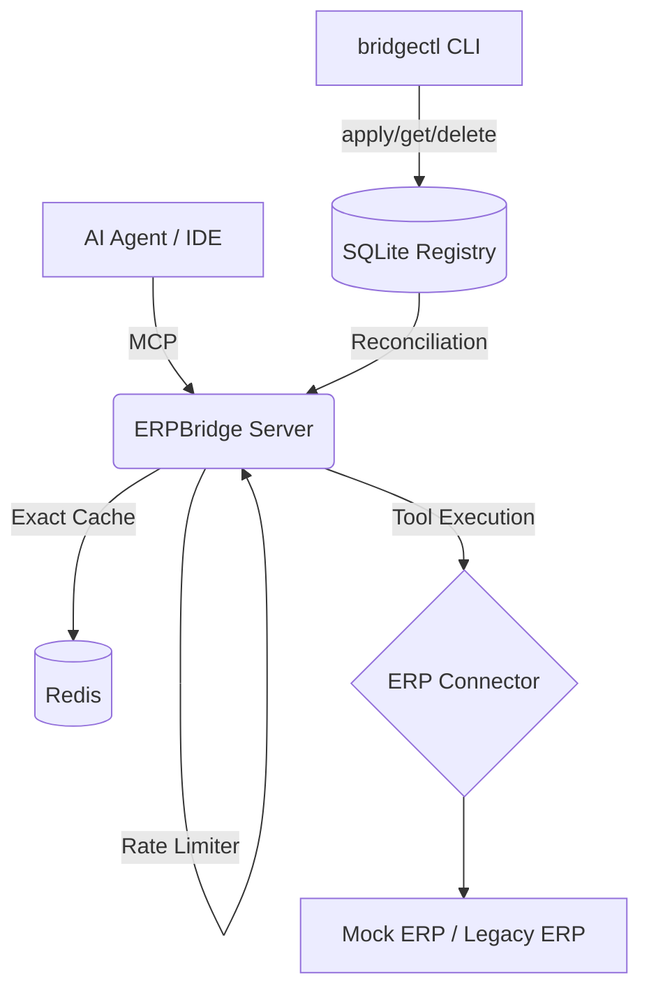

# ERPBridge: AI-to-ERP Model Context Protocol (MCP) Middleware

[](https://github.com/nmdra/ERPBridge/actions/workflows/release.yml)
[](https://go.dev/)
[](https://github.com/nmdra/ERPBridge)
[](https://modelcontextprotocol.io/)
[](https://opensource.org/licenses/MIT)

**ERPBridge** is a middleware that connects legacy Enterprise Resource Planning (ERP) systems to Agentic AI. It uses the **Model Context Protocol (MCP)** to turn complex ERP APIs into discoverable, type-safe tools. AI agents such as Claude, Cursor, or custom LLM chains can use these tools.

## 🚀 Key Features

- **Model Context Protocol (MCP) Native**: Supports the latest MCP specifications.
- **High-Performance Caching**: Exact-match caching layer using Redis and canonical SHA-256 hashing. It reduces redundant ERP API calls.
- **Rate Limiting**: Built-in per-session rate limiting using the token bucket algorithm. It protects legacy ERP infrastructure.
- **Resilience & Fault Tolerance**: Circuit breakers (Sony/GoBreaker) and retry logic (Avast/Retry-Go) handle the instability of legacy systems.
- **Secure Log Streaming**: Real-time structured log streaming to MCP clients. Sensitive data (API keys, passwords, PII) is redacted with `masq` and RFC 5424 level control.
- **Multi-Transport Support**:
  - **Streamable HTTP**: For remote agents and web-based integrations.
  - **Stdio**: Native integration for local IDEs and CLI-based agents.
- **Developer-Centric CLI (`bridgectl`)**: A tool for environment management, schema validation, tool invocation, and real-time monitoring.
- **Metrics & Monitoring**: Native Prometheus integration for tracking performance and health.

## 🏗️ Project Architecture



- **`services/erpbridge-server/`**: The core Go service. It acts as the MCP gateway and Declarative Control Plane.
- **MockERP**: An independent FastAPI service in [`nmdra/mockerp`](https://github.com/nmdra/mockerp). ERPBridge runs its pinned GHCR image as the legacy ERP dependency.
- **`tools/bridgectl/`**: Management CLI for developers and AI agents (Kubernetes-style tool management).
- **`internal/`**: Go libraries for configuration, protocol handling, caching, and resilience.

## 🛠️ Getting Started

### Prerequisites

- **Go**: 1.26.2+
- **Docker & Docker Compose**: For containerized deployment.
- **Redis**: Optional for the caching layer. Without it, the server uses a bounded in-memory LRU cache.
- **SQLite**: (Built-in) used for the Tool Registry.

### Quick Start (Docker)

The fastest way to run the full stack is Docker Compose:

```bash
docker compose up -d --build
```

This launches:

- **ERPBridge Server**: `http://localhost:8080`
- **Mock ERP**: `http://localhost:8081`
- **Redis**: Port `6379`

Then build the CLI and load the default schemas:

```bash
make build
make generate-tools
```

> **Note:** `schemas/` is not tracked by git. `make generate-tools` fetches the pinned MockERP OpenAPI contract from GitHub before generating tools. Override `MOCK_ERP_VERSION` and `MOCK_ERP_OPENAPI_URL` together when upgrading. See the [Onboarding Guide](./docs/onboarding.md) for the full workflow.

### Local Development

1. **Start the pinned MockERP image**:

   ```bash
   make run-mock
   ```

2. **Run ERPBridge Server**:

   ```bash
   # Server creates data/erpbridge.db automatically
   go run services/erpbridge-server/main.go
   ```

3. **Install `bridgectl`**:

   ```bash
   go install ./tools/bridgectl
   ```

4. **Initialize Tools**:

   ```bash
   make generate-tools
   ```

## 🔌 AI Integration

### Local Agents (Claude/Cursor)

Configure your agent to use the Stdio transport via the server binary:

```bash
erpbridge-server --stdio
```

### Remote / Web Clients

Connect via Streamable HTTP:

- **Base URL**: `http://localhost:8080/mcp/`
- **Transport**: MCP 2025-03-26 (the server negotiates up to `2025-11-25`)

For detailed setup instructions, including Postman collections, see the [Connectivity & Transport Guide](./docs/connectivity.md).

## 📚 Documentation

- [**Documentation Wiki**](./docs/README.md) - Central hub for all guides.
- [**CLI Reference**](./docs/cli/bridgectl.md) - Detailed `bridgectl` command documentation.
- [**AI Agent Guide**](./AGENTS.md) - Best practices for agentic integration.
- [**AI Skills**](./skills/bridgectl-ops/SKILL.md) - Operational guidance for AI agents that manage and troubleshoot ERPBridge.
- [**Docker Deployment**](./docs/docker.md) - Production-ready deployment strategies.
- [**Environment Variables**](./docs/environment-variables.md) - Reference for all server and CLI variables.
- [**REST API Reference**](./docs/api.md) - Direct HTTP endpoints of the server.

## 🛠️ Development & Contributing

### Testing

Run the full test suite:

```bash
make test
```

### Quality Control

We enforce quality with `golangci-lint` and `lefthook` for pre-commit checks.

```bash
# Install hooks
lefthook install

# Run linting manually
make lint
```

See [CONTRIBUTING.md](./CONTRIBUTING.md) for how to report bugs and contribute.
