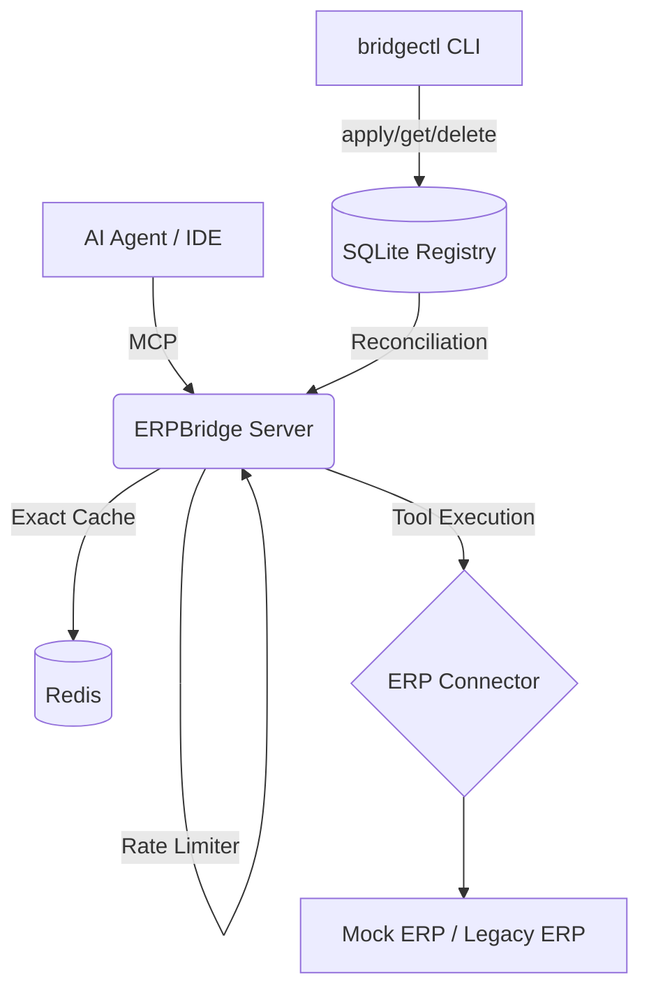

# ERPBridge: AI-to-ERP Model Context Protocol (MCP) Middleware

[](https://github.com/nmdra/ERPBridge/actions/workflows/release.yml)
[](https://go.dev/)
[](https://github.com/nmdra/ERPBridge)
[](https://modelcontextprotocol.io/)
[](https://opensource.org/licenses/MIT)

**ERPBridge** is a high-performance middleware that bridges legacy Enterprise Resource Planning (ERP) systems with Agentic AI. By leveraging the **Model Context Protocol (MCP)**, it transforms complex ERP APIs into discoverable, type-safe tools that AI agents (such as Claude, Cursor, or custom LLM chains) can interact with seamlessly.

## 🚀 Key Features

- **Model Context Protocol (MCP) Native**: Built from the ground up to support the latest MCP specifications.
- **High-Performance Caching**: Optimized exact-match caching layer using Redis and canonical SHA-256 hashing to minimize redundant ERP API hits.
- **Rate Limiting**: Built-in per-session rate limiting using the token bucket algorithm to protect legacy ERP infrastructure.
- **Resilience & Fault Tolerance**: Hardened with circuit breakers (Sony/GoBreaker) and intelligent retry logic (Avast/Retry-Go) to handle the instability of legacy systems.
- **Secure Log Streaming**: Real-time structured log streaming to MCP clients with automatic redaction of sensitive data (API keys, passwords, PII) using `masq` and RFC 5424 level control.
- **Multi-Transport Support**: 
    - **Streamable HTTP**: Ideal for remote agents and web-based integrations.
    - **Stdio**: Native integration for local IDEs and CLI-based agents.
- **Developer-Centric CLI (`bridgectl`)**: A powerful tool for environment management, schema validation, tool invocation, and real-time monitoring.
- **Metrics & Monitoring**: Native Prometheus integration for tracking performance and health.

## 🏗️ Project Architecture



- **`services/erpbridge-server/`**: The core Go service acting as the MCP gateway and Declarative Control Plane.
- **`mock-erp/`**: A Python FastAPI service simulating legacy ERP modules (Finance, HR, Inventory) for development and testing.
- **`tools/bridgectl/`**: Management CLI for developers and AI agents (Kubernetes-style tool management).
- **`internal/`**: Optimized Go libraries for configuration, protocol handling, caching, and resilience.

## 🛠️ Getting Started

### Prerequisites

- **Go**: 1.26.2+
- **Python**: 3.11+ (managed via `uv` is recommended)
- **Docker & Docker Compose**: For containerized deployment.
- **Redis**: Required for the caching layer.
- **SQLite**: (Built-in) used for the Tool Registry.

### Quick Start (Docker)

The fastest way to spin up the entire stack is using Docker Compose:

```bash
docker compose up -d --build
```

This will launch:
- **ERPBridge Server**: `http://localhost:8080`
- **Mock ERP**: `http://localhost:8081`
- **Redis**: Port `6379`

Once running, apply the default schemas:
```bash
bridgectl tool apply -f schemas/erp/
```

### Local Development

1. **Start the Mock ERP**:
   ```bash
   cd mock-erp
   uv run main.py
   ```

2. **Run ERPBridge Server**:
   ```bash
   # Server will create data/erpbridge.db automatically
   go run services/erpbridge-server/main.go
   ```

3. **Install `bridgectl`**:
   ```bash
   go install ./tools/bridgectl
   ```

4. **Initialize Tools**:
   ```bash
   bridgectl tool apply -f schemas/erp/
   ```


## 🔌 AI Integration

### Local Agents (Claude/Cursor)
Configure your agent to use the Stdio transport via `bridgectl`:
```bash
bridgectl serve --stdio
```

### Remote / Web Clients
Connect via Streamable HTTP:
- **Base URL**: `http://localhost:8080/mcp/`
- **Transport**: MCP 2025-03-26

For detailed setup instructions, including Postman collections, see the [Connectivity & Transport Guide](./docs/connectivity.md).

## 📚 Documentation

- [**Documentation Wiki**](./docs/README.md) - Central hub for all guides.
- [**CLI Reference**](./docs/cli/bridgectl.md) - Detailed `bridgectl` command documentation.
- [**AI Agent Guide**](./AGENTS.md) - Best practices for agentic integration.
- [**Docker Deployment**](./docs/docker.md) - Production-ready deployment strategies.

## 🛠️ Development & Contributing

### Testing
Run the full test suite:
```bash
go test ./...
```

### Quality Control
We enforce high standards using `golangci-lint` and `lefthook` for pre-commit checks.
```bash
# Install hooks
lefthook install

# Run linting manually
golangci-lint run
```

