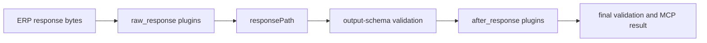
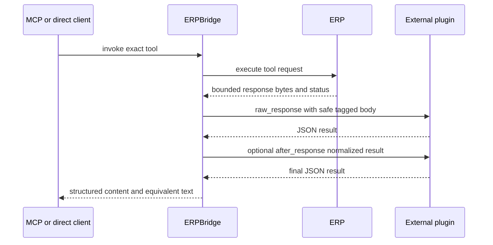

# ERPBridge V2 Architecture: Declarative Control Plane

ERPBridge V2 adopts a **Declarative Control Plane** architecture, inspired by Kubernetes. This design moves away from static, file-system-bound configurations toward a live API-managed resource system for MCP tools.

## 🏗 High-Level Overview

The system is divided into three distinct layers:

1. **Management Layer (The CLI)**: Developers use `bridgectl` to declare the desired state of the system by "applying" YAML/JSON resource definitions.
2. **Control Plane (The Server)**: A centralized API server stores tool definitions in a persistent SQLite database, validates them against strict admission rules, and manages versioning.
3. **Runtime Layer (MCP Engine)**: A background reconciliation controller keeps the active MCP server aligned with the desired state in the database.

---

## 🧩 Endpoint vs. Tool: Key Concepts

One of the most important concepts in ERPBridge V2 is the distinction between registering an **API Endpoint** and applying an **MCP Tool**.

| Feature | **API Endpoint** (`api register`) | **MCP Tool** (`tool apply`) |
| :--- | :--- | :--- |
| **Mental Model** | Technical Discovery | Declarative Management |
| **Primary Focus** | The ERP System (technical) | The AI Agent (semantic) |
| **Storage** | Local CLI Config (`config.yaml`) | Server Registry (`erpbridge.db`) |
| **Visibility** | **Hidden from AI** | **Visible to AI** (as an MCP Tool) |
| **Stability** | Experimental / Internal | Versioned / Stable |
| **Command** | `bridgectl api register ...` | `bridgectl tool apply -f ...` |

### Why separate them?

- **Technical vs. Semantic**: A single ERP API endpoint (e.g., `/api/v1/resource/Employee`) might be used by multiple MCP tools with different filters or versions.
- **Safety**: Registering an API is a developer-only technical step. Applying a tool is a conscious decision to expose functionality to an AI agent.
- **Lifecycle**: You can "discover" and test 100 API endpoints locally, but only "apply" the 5 that are safe and ready for the LLM to use.

---

## 🛠 Core Components

### 1. Tool Resource Registry (The Source of Truth)

Instead of loading files from a directory, the server maintains an internal **Tool Registry** backed by **SQLite**. This registry stores multiple versions of the same tool, allowing for safe rollouts and rollbacks.

Each tool includes an `IsActive` flag. When a tool is "deleted" via the CLI, it is not immediately purged from the database. Instead, it is marked as `IsActive = false`. This "soft-delete" pattern allows the system to manage visibility without breaking existing MCP sessions.

### 2. Version Resolver

When an AI agent requests a tool (e.g., `list_employees`), the **Version Resolver** automatically selects the **latest stable version** (e.g., `list_employees@1.2.0`). It explicitly ignores any tools marked as inactive.

### 3. Visibility Filtering (JSON-RPC Interception)

Because the underlying MCP runtime does not always support dynamic removal of tools from an active session, ERPBridge implements a **Visibility Filtering Layer**.

- **The Problem**: Once a tool is registered in memory, standard libraries often provide no way to "unregister" it without a restart.
- **The Solution**: ERPBridge wraps the MCP server's HTTP handler and intercepts the `tools/list` response. Before the JSON-RPC result reaches the client, ERPBridge parses the list and removes any tools marked as `IsActive = false` in the internal registry.
- **Result**: The client receives a truthful list of tools. The list matches the desired state of the control plane. This works even when the underlying runtime still knows the "ghost" tools.

### 4. Reconciliation Controller

The server runs a background reconciliation controller. It keeps the in-memory MCP registry in sync with the SQLite database.

The controller runs every 10 seconds. It compares the database state against the desired state:

- If a tool exists in SQLite but not in the registry, the controller registers it.
- If a tool is inactive (soft-deleted) or missing from SQLite, the controller deregisters it from the MCP runtime.
- If a tool changes, the controller re-registers the new version.

Each check uses a SHA-256 state hash from the store. The hash covers ordered tool, plugin, and binding identity, activity, update timestamp, and stored resource data. If the hash is unchanged, the controller skips the pass. This keeps the check cheap.

When the registry changes, the controller sends the `notifications/tools/list_changed` notification to all active MCP sessions.

The controller also runs immediately after a `tool apply` HTTP request. The tool is visible to agents right after apply. It does not wait for the next 10-second tick.

### 5. External response plugins

ERPBridge invokes an already-running external plugin. The control plane stores
only the plugin endpoint and exact version. It never installs, starts, upgrades,
or schedules plugin code.

A `PluginBinding` connects one exact `Plugin{name, version}` to one exact
`MCPTool{name, version}`. A `raw_response` binding runs first and receives a
bounded ERP response with status, normalized content type, and a tagged JSON or
base64 body. It can adapt media, such as an ERP image to `{text: ...}`. The
plugin cannot change status or receive ERP headers, URLs, credentials, caller
identity, or original arguments. The developer owns the final object-shaped MCP
output schema; plugins never change it dynamically. An incompatible output
meaning requires a new MCP-visible tool name and exact tool version.

For successful responses, the fixed order is:

Terminal non-2xx responses can be inspected by raw plugins while retaining ERP
retry and circuit-breaker accounting. They remain errors, including 3xx. They
do not run success-only normalization or after-response processing.

The pipeline runs only on a cache miss. The cache stores the final transformed
MCP result and never stores an error result, so a cache hit does not invoke ERP
or plugins. Applying, changing, or deleting a plugin or binding flushes the
affected tool cache entries. `continue` uses the original captured response
only when it satisfies the developer-owned final schema; otherwise it returns a
safe error. Use `fail` for media conversion unless a compatible fallback is
known.

---

## 🛠 Tool Generation & Templating

ERPBridge uses a "Template-Based Generation" approach. When generating tools (especially in bulk from OpenAPI):

1. **The Template**: A `Registered API` acts as the source of technical truth (URL, Auth, Module).
2. **The Spec**: An `OpenAPI Definition` acts as the source of semantic truth (Paths, Parameters, Descriptions).
3. **The Result**: The generator merges these, creating production-ready MCP tools that are pre-configured with your environment's connectivity and security settings.

This decoupling allows you to use the same OpenAPI spec to generate tools for different environments (Dev, Staging, Prod) simply by pointing to a different registered API.

---

## 🔄 Lifecycle of a Tool Change

1. **Define**: Developer creates a V2 YAML schema for a new tool.
2. **Validate**: Runs `bridgectl tool validate -f tool.yaml` to check for syntax and admission rules (e.g., no raw secrets).
3. **Apply**: Runs `bridgectl tool apply -f tool.yaml`.
4. **Store**: The ERPBridge API validates the payload again and saves it to the SQLite `tools` table.
5. **Reconcile**: The background controller detects the new DB entry and registers it with the `mcp-go` runtime.
6. **Execute**: AI agents now see the new tool and can invoke it immediately.

---

## 🛡 Security Design

- **Secret Decoupling**: Schemas never contain raw tokens or keys. They only contain a reference (`credentialRef`). The middleware resolves these references at the moment of execution using secure environment variables.
- **Admission Controllers**: The API server rejects any tool definition that contains suspicious strings (like `token` or `key=`) in its endpoint path. Plugin endpoints must be absolute `http` or `https` URLs without userinfo, query parameters, or fragments.
- **Redaction**: Root, buffered, and MCP log sinks filter sensitive attributes using `internal/types/sensitive.go`. ERP request and response bodies are never logged.
